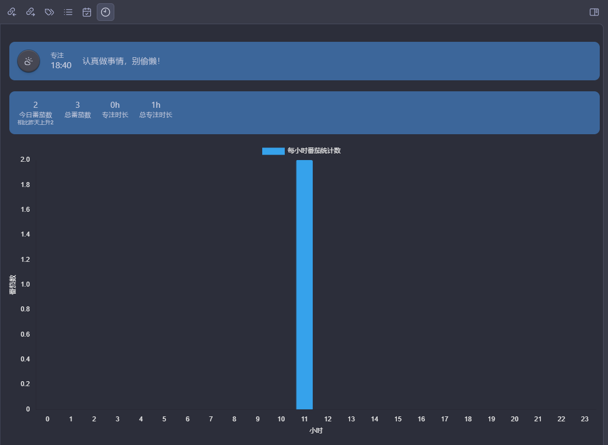
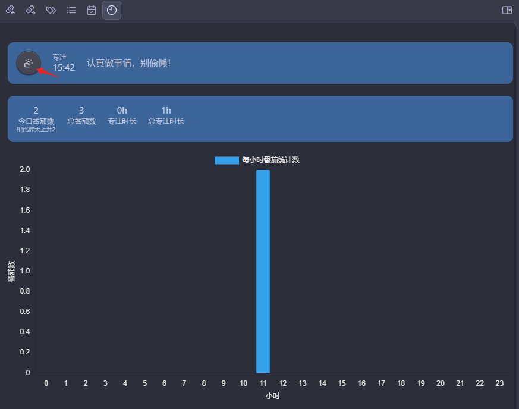
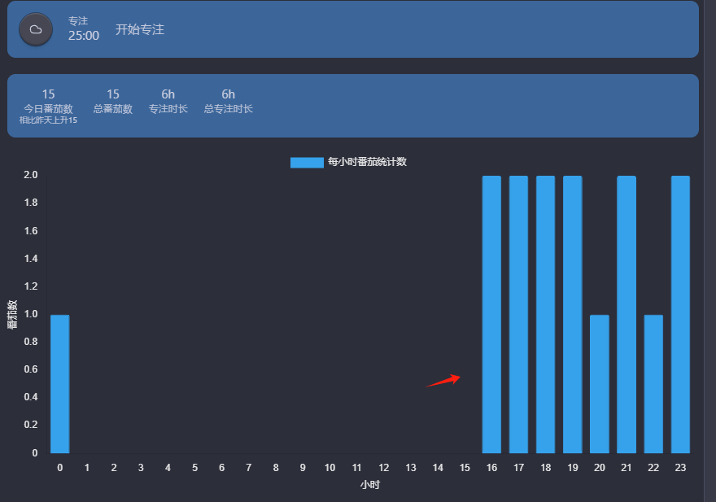

Introduction:
This is a simple Pomodoro timer designed to help you focus on work and track your daily productivity. Whether you're a student, freelancer, or corporate employee, it can help you boost your productivity and make the most of every minute.

Features:
Customizable Focus Messages: Set motivational quotes to enhance your work drive.
Customizable Break Messages: Remind yourself to take breaks at the right times to maintain peak performance.
Pomodoro Count Tracking: Visually display the number of completed Pomodoros for a sense of achievement.
Real-time Hourly Pomodoro Tracking: Analyze your work efficiency and optimize time management.
Usage:
1. Press Ctrl+P to open commands and search for Luck Pomodoro

2. Set your data storage folder, messages, and focus time
Choose your preferred folder to save data, enter your desired messages and focus duration to easily customize your Pomodoro timer.

3. Click the button to toggle between focus and break states
The simple button design allows you to easily switch between focus and break, maintaining a good work rhythm.

4. Record your daily focus status
Automatically generate daily focus records to help you review and reflect, continuously optimizing your work efficiency.

5. Enhance your work experience
By regularly alternating between focus and breaks, you'll find that your work becomes more efficient and clearer, with creativity flowing continuously. Let the Pomodoro timer be your powerful assistant in boosting productivity, helping you achieve your goals and surpass yourself.

Start your journey towards efficient work and experience the magical transformation brought by the Pomodoro Technique!