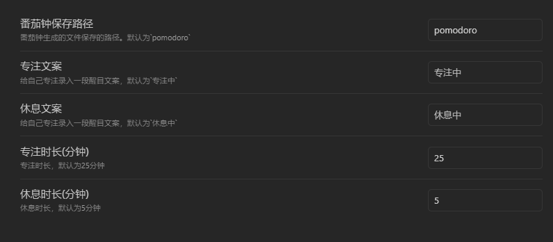

## 简介：

这是一款简易的番茄时钟，方便您专注于工作，跟踪您一天的工作效率。无论您是学生、自由职业者还是企业员工，它都能帮助您提升生产力，充分利用每一分钟。

## 特点：

- **设置专注标语**：自定义激励语句，提升工作动力。
- **设置休息标语**：提醒您适时休息，保持最佳状态。
- **统计番茄数**：直观显示您完成的番茄时长，成就感满满。
- **实时追踪每小时番茄数**：分析工作效率，优化时间管理。

## 使用：

### 1. `Ctrl+P` 打开命令，搜索 Luck Pomodoro

### 2. 设置存储数据文件夹、标语、专注时间

选择您喜欢的文件夹来保存数据，输入您想要的标语和专注时长，轻松定制您的专属番茄时钟。

### 3. 点击按钮，切换专注、休息状态

简单的按钮设计，让您轻松在专注与休息之间切换，保持良好的工作节奏。

### 4. 记录每天专注情况

自动生成每日专注记录，助您回顾和反思，持续优化自己的工作效率。

### 5. 提升工作体验

通过定期的专注与休息，您将发现工作变得更加高效、清晰，创意源源不断。让番茄时钟成为您提升生产力的得力助手，帮助您实现目标、超越自我。

开始您的高效工作之旅，体验番茄工作法带来的神奇变化吧！
